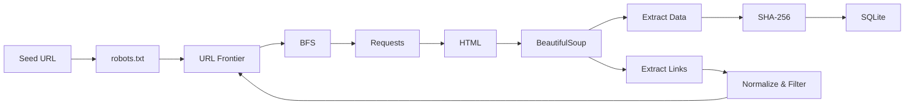

# SEG301 - Wikipedia Movies Focused Web Crawler

> **Chủ đề:** Movies & Entertainment  
> **Nguồn crawl:** Wikipedia  
> **Phương pháp:** Focused Web Crawling + BFS  
> **Output:** SQLite Database

Crawler thu thập dữ liệu phim trực tiếp từ Wikipedia, bắt đầu từ trang `Lists_of_films`, tự phát hiện hyperlink, lọc URL phù hợp với chủ đề phim và lưu dữ liệu vào SQLite.

---

## 1. Pipeline



Pipeline rút gọn:

```text
Seed URL
   ↓
robots.txt
   ↓
URL Frontier
   ↓
BFS
   ↓
Requests
   ↓
HTML
   ↓
BeautifulSoup
   ↓
Extract Data + Hyperlinks
   ↓
Normalize / Filter URL
   ↓
Đưa URL mới vào Frontier
   ↓
SQLite
```

---

## 2. Phạm vi crawl

Seed:

```text
https://en.wikipedia.org/wiki/Lists_of_films
```

Crawler duyệt theo BFS:

```text
Depth 0
└── Lists_of_films

Depth 1
└── Các trang danh sách phim A-Z / grouped list pages

Depth 2
└── Các trang movie article
```

Các movie article được xem là điểm dừng. Crawler không tiếp tục đi sang actor, director, country, reference hoặc các chủ đề Wikipedia không liên quan.

---

## 3. Phương pháp sử dụng

### Focused Web Crawling

Không follow toàn bộ hyperlink trên website.

Crawler chỉ giữ các URL phù hợp với scope **Movies**, nhờ đó tránh crawl lan sang nội dung không liên quan.

### BFS - Breadth-First Search

URL được duyệt theo từng tầng:

```text
Depth 0 → Depth 1 → Depth 2
```

URL Frontier dùng `deque`:

```python
append()      # thêm URL mới
popleft()     # lấy URL đầu hàng đợi
```

### URL Frontier

URL Frontier là hàng đợi chứa các URL:

> **đã được phát hiện nhưng chưa được crawl**

Crawler dùng thêm:

- `queued`: URL đang chờ trong Frontier
- `visited`: URL đã crawl

để tránh crawl trùng URL.

---

## 4. Cách crawler xử lý một trang

Với mỗi URL, crawler thực hiện:

1. Kiểm tra URL có được phép theo `robots.txt`.
2. Gửi HTTP request bằng `requests`.
3. Nhận HTML từ Wikipedia.
4. Parse HTML bằng `BeautifulSoup`.
5. Lấy `title`, text content và metadata.
6. Extract các hyperlink `<a href="...">`.
7. Normalize và filter URL.
8. URL hợp lệ và chưa xuất hiện sẽ được thêm vào Frontier.
9. Nội dung được kiểm tra duplicate bằng SHA-256.
10. Kết quả được lưu vào SQLite.

---

## 5. URL Filtering

Crawler chỉ giữ các URL phù hợp với scope.

Một số rule chính:

- chỉ nhận `http` / `https`
- chỉ nhận domain `en.wikipedia.org`
- chỉ nhận article path `/wiki/...`
- loại URL fragment và query không cần thiết
- loại ảnh, CSS, JavaScript, PDF, ZIP, audio, video...
- loại namespace không liên quan như:
  - `Special:`
  - `Help:`
  - `Template:`
  - `Talk:`
  - `User:`
  - `Category:`
  - `File:`

---

## 6. Duplicate Detection

Crawler xử lý hai loại duplicate.

| Loại | Cách xử lý |
|---|---|
| Trùng URL | `queued` + `visited` |
| Trùng nội dung | SHA-256 |

SHA-256 tạo một hash đại diện cho nội dung trang.

Nếu hai URL khác nhau có cùng nội dung, crawler có thể phát hiện bằng content hash.

---

## 7. robots.txt và Rate Limit

Trước khi crawl, chương trình đọc:

```text
https://en.wikipedia.org/robots.txt
```

Crawler dùng `RobotFileParser` để kiểm tra URL có được phép crawl hay không.

Cấu hình mặc định:

```text
Request timeout : 30 giây
Crawl delay     : 2 giây
Max retries     : 6
```

Nếu gặp HTTP `429` hoặc `503`, crawler hỗ trợ:

- `Retry-After`
- exponential backoff
- retry request

---

## 8. Dữ liệu được lưu

Output:

```text
data/wikipedia_movies.db
```

### Bảng `pages`

Lưu dữ liệu chính của từng trang:

- URL
- domain
- page type
- title
- content
- depth
- HTTP status
- response time
- crawl time
- SHA-256 hash
- probable-film flag

### Bảng `links`

Lưu hyperlink graph:

```text
source_url → target_url
```

### Bảng `movies`

Lưu một số metadata lấy từ infobox:

- title
- director
- release date
- running time
- country
- language

### Các bảng hỗ trợ

- `errors`
- `robots_checks`
- `crawl_runs`

---

## 9. Cấu trúc source code

```text
Assignment1/
├── main.py
├── config.py
├── crawler.py
├── url_frontier.py
├── parser.py
├── duplicate.py
├── database.py
├── validate.py
├── requirements.txt
├── README.md
└── data/
```

| File | Chức năng |
|---|---|
| `main.py` | Entry point, nhận command chạy crawler |
| `config.py` | Cấu hình seed, depth, page limit, delay |
| `crawler.py` | Logic crawl chính |
| `url_frontier.py` | BFS Frontier, queued, visited |
| `parser.py` | Parse HTML, extract data/link, filter URL |
| `duplicate.py` | SHA-256 duplicate detection |
| `database.py` | SQLite schema |
| `validate.py` | Kiểm tra và thống kê kết quả |

---

## 10. Cài đặt

```powershell
py -m venv .venv
.venv\Scripts\activate
pip install -r requirements.txt
```

Kiểm tra robots.txt:

```powershell
python main.py robots-check
```

---

## 11. Chạy test

```powershell
python main.py crawl-test --reset --delay 2
```

Test mặc định giới hạn:

```text
100 pages
```

Ví dụ kết quả test thành công:

```text
Pages saved             : 100
Movie candidates saved  : 79
Links saved             : 55,236
Failed requests         : 0
Robots blocked          : 0
Rate-limit responses    : 0

Depth 0                 : 1
Depth 1                 : 20
Depth 2                 : 79

RESULT: PASS
```

---

## 12. Chạy full crawl

```powershell
python main.py crawl-full --reset
```

Cấu hình mặc định:

```text
MAX_DEPTH   = 2
MAX_PAGES   = 100,000
CRAWL_DELAY = 2 giây
```

Có thể đặt giới hạn khác:

```powershell
python main.py crawl-full --reset --max-pages 5000
```

---

## 13. Resume khi bị gián đoạn

Nếu đang crawl mà terminal bị đóng hoặc bấm `Ctrl + C`, dữ liệu đã crawl vẫn được giữ trong SQLite.

Chạy lại:

```powershell
python main.py crawl-full
```

**Không dùng `--reset` khi muốn resume.**

Crawler sẽ phục hồi:

```text
pages đã crawl
      ↓
visited
      ↓
hyperlink graph
      ↓
URL đã discover nhưng chưa crawl
      ↓
Frontier
      ↓
tiếp tục crawl
```

---

## 14. Validation

Chạy:

```powershell
python main.py validate
```

Validation kiểm tra:

- tổng số page
- số page theo depth
- movie candidate
- probable film
- hyperlink
- invalid page
- HTTP status
- duplicate URL
- duplicate content
- crawl error
- stopping condition

Kết quả hợp lệ:

```text
RESULT: PASS
```

---

## 15. Điều kiện dừng

Crawler dừng khi:

```text
URL Frontier is empty
```

hoặc:

```text
MAX_PAGES reached
```

Nếu `MAX_PAGES reached`, dữ liệu đã crawl vẫn hợp lệ nhưng không được xem là đã crawl hết toàn bộ frontier.

---

## Tóm tắt

```text
Focused Web Crawling + BFS
        ↓
URL Frontier
        ↓
Requests
        ↓
BeautifulSoup
        ↓
Extract Data + Hyperlinks
        ↓
Normalize / Filter
        ↓
Duplicate Detection
        ↓
SQLite
```

**Crawler bắt đầu từ danh sách phim của Wikipedia, tự discover các URL phim thông qua hyperlink, crawl theo BFS, lọc đúng scope Movies và lưu kết quả vào SQLite.**
