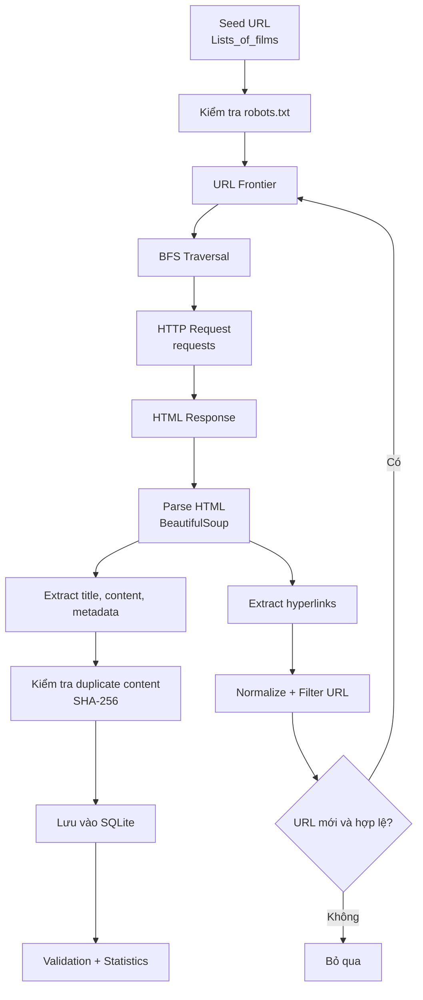

SEG301 – Wikipedia Movies Focused Web Crawler
Một Focused Web Crawler chạy trên web public thật cho chủ đề Movies & Entertainment, được xây dựng cho môn SEG301.
Crawler bắt đầu từ một trang seed duy nhất trên Wikipedia, sau đó tự tìm các trang danh sách phim, lần theo hyperlink đến các trang phim, trích xuất nội dung và metadata, rồi lưu kết quả crawl vào SQLite.
---
1. Tổng quan dự án
Seed URL
```text
https://en.wikipedia.org/wiki/Lists_of_films
```
Các kỹ thuật chính
Focused Web Crawling
Breadth-First Search (BFS)
URL Frontier bằng `deque`
`requests` để gửi HTTP request
`BeautifulSoup` + `lxml` để parse HTML
Chuẩn hóa và lọc URL
`queued` + `visited` để tránh crawl trùng URL
SHA-256 để phát hiện duplicate content
Kiểm tra `robots.txt`
Retry / backoff khi gặp HTTP `429` hoặc `503`
Lưu dữ liệu bằng SQLite
Hỗ trợ resume khi crawl bị gián đoạn
Validation và thống kê kết quả crawl
Crawler sử dụng Wikipedia thật trên Internet, không dùng local mirror và không dùng dataset phim tải sẵn để giả lập website.
---
2. Pipeline Crawling

Pipeline rút gọn:
```text
Seed URL
   ↓
Kiểm tra robots.txt
   ↓
URL Frontier
   ↓
BFS
   ↓
Requests
   ↓
HTML
   ↓
BeautifulSoup
   ↓
Extract Data + Hyperlinks
   ↓
Normalize / Filter URL
   ↓
Đưa URL mới vào Frontier
   ↓
SQLite
   ↓
Validation
```
---
3. Phạm vi Focused BFS
Crawler chỉ tập trung vào cấu trúc liên quan đến phim.
```text
Depth 0
└── Lists_of_films

Depth 1
├── List_of_films:_A
├── List_of_films:_B
├── ...
├── List_of_films:_J–K
├── List_of_films:_N–O
├── List_of_films:_Q–R
├── List_of_films:_U–V–W
├── List_of_films:_X–Y–Z
└── List_of_films:_numbers

Depth 2
└── Các movie article được phát hiện
```
Các trang movie article được xem là terminal node.
Crawler không tiếp tục đi từ trang phim sang các chủ đề khác như:
diễn viên
đạo diễn
quốc gia
âm nhạc
reference
các trang điều hướng chung của Wikipedia
các namespace đặc biệt / admin
Đây là lý do crawler này được gọi là Focused Crawler, thay vì crawler thông thường gặp link nào cũng follow.
---
4. Tại sao dùng BFS?
Crawler sử dụng Breadth-First Search (BFS), tức duyệt theo chiều rộng.
BFS xử lý URL theo từng tầng:
```text
Depth 0 → toàn bộ Depth 1 → toàn bộ Depth 2
```
URL Frontier dùng `deque`:
```python
append()   # thêm URL mới vào cuối hàng đợi
popleft()  # lấy URL ở đầu hàng đợi ra crawl
```
Ưu điểm:
dễ kiểm soát `MAX_DEPTH`
duyệt theo level rõ ràng
phù hợp với cấu trúc crawl từ seed → list page → movie page
đúng yêu cầu BFS của assignment
---
5. URL Frontier là gì?
URL Frontier là hàng đợi chứa các URL đã được phát hiện nhưng chưa crawl.
Ví dụ:
```text
Frontier:
[A, B, C]

crawl A
↓
phát hiện thêm D, E
↓

Frontier:
[B, C, D, E]
```
Crawler sử dụng:
`queued`: URL đang nằm trong Frontier
`visited`: URL đã crawl xong
Mục đích là tránh cùng một URL bị add hoặc request nhiều lần.
---
6. Kiểm tra robots.txt
Trước khi crawl, chương trình kiểm tra:
```text
https://en.wikipedia.org/robots.txt
```
Crawler dùng `RobotFileParser` và gọi `can_fetch()` trước khi request URL.
Mục đích:
tôn trọng quy định crawl của website
tránh các path bị hạn chế
tránh khu vực special/admin
dừng nếu seed URL không được phép crawl
Crawler cũng sử dụng User-Agent mô tả rõ đây là bot phục vụ mục đích học thuật.
---
7. HTTP Request và xử lý Rate Limit
Trang web được tải bằng:
```python
requests
```
Cấu hình mặc định:
```text
Request timeout : 30 giây
Crawl delay     : 2 giây
Max retries     : 6
```
Nếu Wikipedia trả về:
```text
HTTP 429
HTTP 503
```
crawler sẽ:
kiểm tra header `Retry-After`;
chờ đúng khoảng thời gian được yêu cầu nếu có;
nếu không có thì dùng exponential backoff;
retry request.
Mục đích là tránh gửi request quá nhanh lên website public.
---
8. Parse HTML
HTML được parse bằng:
```text
BeautifulSoup + lxml
```
Crawler lấy:
title
visible text content
hyperlink (`<a href="...">`)
một số movie metadata từ infobox
Ví dụ hyperlink:
```html
<a href="/wiki/Inception">Inception</a>
```
Crawler sẽ chuyển relative URL thành absolute URL rồi kiểm tra xem URL đó có nằm trong scope cần crawl hay không.
---
9. Normalize và Filter URL
Trước khi URL mới được đưa vào Frontier, crawler sẽ chuẩn hóa và lọc.
Các rule chính:
chỉ giữ `http` / `https`
chỉ giữ domain `en.wikipedia.org`
chỉ giữ path dạng `/wiki/...`
bỏ URL fragment
bỏ query string không cần thiết
bỏ file ảnh, CSS, JavaScript, PDF, ZIP, audio, video...
bỏ các namespace như:
`Special:`
`Wikipedia:`
`Help:`
`Template:`
`Talk:`
`User:`
`Category:`
`File:`
`MediaWiki:`
Các rule focused cũng giúp crawler không đi lạc khỏi chủ đề Movies.
---
10. Duplicate Detection
Crawler dùng hai cơ chế chống trùng.
Duplicate URL
Dùng:
```text
queued
visited
```
Mục đích:
URL đã có trong Frontier thì không add lại
URL đã crawl rồi thì không request lại
Duplicate Content
Nội dung trang được hash bằng:
```text
SHA-256
```
SHA-256 có thể hiểu như một “dấu vân tay” của content.
Nếu hai URL khác nhau nhưng trả về nội dung giống hệt nhau thì SHA-256 giúp phát hiện duplicate content.
---
11. Lưu dữ liệu bằng SQLite
Database output:
```text
data/wikipedia_movies.db
```
Bảng `pages`
Đây là collection chính của Search Engine.
Lưu:
URL
domain
page type
title
visible text content
BFS depth
HTTP status code
response time
crawl timestamp
SHA-256 content hash
validation flags
probable-film flag
Bảng `links`
Lưu hyperlink graph:
```text
source_url
target_url
```
Bảng `movies`
Lưu movie metadata lấy từ Wikipedia infobox:
title
director
release date
running time
country
language
probable-film flag
Bảng `errors`
Lưu request lỗi hoặc lỗi trong quá trình crawl.
Bảng `robots_checks`
Lưu kết quả kiểm tra robots.txt.
Bảng `crawl_runs`
Lưu thông tin từng lần chạy:
thời gian bắt đầu
thời gian kết thúc
seed URL
max depth
max pages
số page đã lưu
số movie đã lưu
số request lỗi
stop reason
---
12. Probable Film Detection
Mỗi trang ở Depth 2 được xem là một movie candidate.
Crawler tiếp tục kiểm tra infobox để tìm các tín hiệu như:
```text
Directed by
Release date
Running time
Produced by
```
Nếu đủ tín hiệu liên quan đến phim, trang được đánh dấu:
```text
probable_film = 1
```
Flag này dùng để phân tích chất lượng dữ liệu, không thay đổi logic BFS.
---
13. Cấu trúc project
```text
Assignment1/
├── main.py
├── config.py
├── crawler.py
├── url_frontier.py
├── parser.py
├── duplicate.py
├── database.py
├── validate.py
├── requirements.txt
├── README.md
├── PRESENTATION_CHEAT_SHEET.md
├── TEST_BEFORE_FULL.md
├── .gitignore
└── data/
    └── wikipedia_movies.db
```
File	Chức năng
`main.py`	Entry point và command chạy crawler
`config.py`	Seed URL, depth, page limit, timeout, delay, path
`crawler.py`	Vòng lặp crawl chính, Requests, robots, retry, BFS
`url_frontier.py`	BFS queue, `queued`, `visited`
`parser.py`	Parse HTML, extract link, filter URL
`duplicate.py`	Phát hiện duplicate content bằng SHA-256
`database.py`	SQLite schema và kết nối database
`validate.py`	Kiểm tra kết quả crawl và thống kê
---
14. Cài đặt
Tạo virtual environment:
```powershell
py -m venv .venv
```
Kích hoạt:
```powershell
.venv\Scripts\activate
```
Cài thư viện:
```powershell
pip install -r requirements.txt
```
---
15. Kiểm tra robots.txt
Chạy:
```powershell
python main.py robots-check
```
Kết quả mong đợi:
```text
[robots] Seed -> ALLOW
```
---
16. Chạy test
Nên chạy test trước:
```powershell
python main.py crawl-test --reset --delay 2
```
Test mặc định:
```text
100 saved pages
```
Một test ổn nên có:
```text
Root pages               : 1
List pages               : > 0
Movie candidate pages    : > 0
Failed requests          : 0
Unresolved crawl errors  : 0
RESULT: PASS
```
Ví dụ test thành công:
```text
Pages saved             : 100
Movie candidates saved  : 79
Links saved             : 55,236
Failed requests         : 0
Robots blocked          : 0
Rate-limit responses    : 0

Depth 0                 : 1
Depth 1                 : 20
Depth 2                 : 79

Root pages              : 1
List pages              : 20
Movie candidate pages   : 79
Probable film articles  : 77

RESULT: PASS
```
Test dừng với:
```text
MAX_PAGES reached
```
là bình thường vì test cố tình giới hạn 100 page.
---
17. Chạy full crawl
Chạy:
```powershell
python main.py crawl-full --reset
```
Cấu hình mặc định:
```text
MAX_DEPTH   = 2
MAX_PAGES   = 100,000
CRAWL_DELAY = 2 giây
```
Có thể giới hạn nhỏ hơn:
```powershell
python main.py crawl-full --reset --max-pages 5000
```
hoặc:
```powershell
python main.py crawl-full --reset --max-pages 20000
```
---
18. Resume khi bị gián đoạn
Crawler hỗ trợ resume.
Nếu terminal bị đóng hoặc cậu bấm:
```text
Ctrl + C
```
thì không dùng `--reset`.
Chạy lại:
```powershell
python main.py crawl-full
```
Crawler sẽ:
đọc các page đã lưu trong SQLite;
đưa chúng vào `visited`;
khôi phục content hash;
đọc hyperlink graph đã lưu;
tìm các URL đã discover nhưng chưa crawl;
khôi phục Frontier;
crawl tiếp phần còn lại.
Không cần chạy lại từ đầu.
---
19. Validation
Chạy:
```powershell
python main.py validate
```
Validation kiểm tra:
tổng số page
số root page
số list page
số movie candidate
số probable film
tổng số link
invalid page
page không phải HTTP 200
duplicate URL
duplicate content
unresolved crawl error
số page theo BFS depth
stop reason của lần chạy gần nhất
Kết quả tốt:
```text
RESULT: PASS
```
---
20. Điều kiện dừng crawler
Crawler dừng trong hai trường hợp.
1. URL Frontier rỗng
```text
Stop reason: URL Frontier is empty
```
Nghĩa là mọi URL đã được discover trong scope hiện tại đều đã được xử lý.
2. Đạt MAX_PAGES
```text
Stop reason: MAX_PAGES reached
```
Nghĩa là crawler dừng vì giới hạn số page đã cấu hình.
Trong trường hợp này không được nói rằng crawler đã crawl hết toàn bộ frontier.
Tuy nhiên dữ liệu đã lưu vẫn hợp lệ để:
demo crawler
phân tích
indexing
xây dựng Search Engine ở bước sau
---
21. Phạm vi của project
Project này không claim crawl toàn bộ Wikipedia.
Scope được định nghĩa là:
```text
Lists_of_films
        ↓
film index/list pages
        ↓
movie article candidates
```
Vì vậy tính đầy đủ của crawl chỉ được đánh giá trong phạm vi focused scope và stopping condition đã cấu hình.
---
22. Các fix ở bản V2
Bản V2 được chỉnh sau khi test trực tiếp với Wikipedia live:
User-Agent mô tả rõ bot học thuật
delay mặc định tăng lên 2 giây
xử lý HTTP `429`
xử lý HTTP `503`
hỗ trợ header `Retry-After`
exponential backoff
retry tối đa 6 lần
hỗ trợ các grouped film index page:
`List_of_films:_J–K`
`List_of_films:_N–O`
`List_of_films:_Q–R`
`List_of_films:_U–V–W`
`List_of_films:_X–Y–Z`
Wikipedia không chia đơn giản thành đúng 26 trang A-Z riêng biệt, nên cần hỗ trợ các grouped page để crawl đúng cấu trúc live hiện tại.
---
23. Tóm tắt phương pháp
```text
Phương pháp:
Focused Web Crawling + BFS

Seed:
https://en.wikipedia.org/wiki/Lists_of_films

HTTP:
Requests

HTML Parser:
BeautifulSoup + lxml

URL Frontier:
deque

Chống trùng URL:
queued + visited

Chống trùng content:
SHA-256

Database:
SQLite

Policy:
robots.txt + polite crawl delay

Điều kiện dừng:
MAX_PAGES hoặc URL Frontier rỗng
```
---
24. Giải thích ngắn gọn toàn bộ hệ thống
> Crawler bắt đầu từ trang danh sách phim của Wikipedia, dùng BFS để lần theo hyperlink đến các trang phim, dùng Requests để tải HTML, BeautifulSoup để parse nội dung, filter URL để giữ đúng scope Movies, loại duplicate và lưu toàn bộ kết quả vào SQLite.
