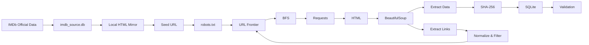

# SEG301 – IMDb Focused Web Crawler qua Local HTML Mirror

> **Chủ đề:** Movies & Entertainment  
> **Nguồn dữ liệu:** IMDb Official Dataset / IMDb source database  
> **Cơ chế crawl:** Focused Web Crawling + BFS  
> **HTTP client:** Requests  
> **HTML parser:** BeautifulSoup  
> **Output:** SQLite Database

Project này xây dựng một **Web Crawler theo BFS** cho dữ liệu IMDb.

Do IMDb hiện chặn generic crawler trong `robots.txt`, project **không crawl trực tiếp `imdb.com`**. Thay vào đó, dữ liệu IMDb chính thức được dùng để dựng một **local HTML mirror**, sau đó crawler hoạt động đúng cơ chế Web Crawler:

```text
Seed URL
→ HTTP Request
→ HTML
→ Parse dữ liệu + Hyperlink
→ URL Frontier
→ BFS
→ SQLite
```

> **Lưu ý:** đây là crawler của một **local IMDb mirror**, không phải claim rằng `www.imdb.com` đã được crawl trực tiếp.

---

## 1. Tại sao phải dùng Local HTML Mirror?

Nguồn được giao là IMDb.

Tuy nhiên, generic crawler hiện bị IMDb chặn trong `robots.txt`, trong khi assignment yêu cầu phải tôn trọng crawling restriction.

Vì vậy project tách thành hai phần:

```text
IMDb Official Data
        ↓
imdb_source.db
        ↓
Local HTML Mirror
        ↓
Web Crawler
        ↓
imdb.db
```

Cụ thể:

1. IMDb official dataset hoặc database IMDb đã có cung cấp movie records.
2. `mirror_server.py` đọc source database và render thành các trang HTML.
3. Các trang này được serve qua HTTP tại `127.0.0.1`.
4. Crawler bắt đầu từ một Seed URL.
5. Crawler dùng Requests để tải HTML.
6. BeautifulSoup parse HTML, lấy dữ liệu và hyperlink.
7. URL mới được normalize, filter và đưa vào BFS URL Frontier.
8. Kết quả cuối cùng được lưu vào SQLite.

Crawler **không đọc source DB để tạo output trực tiếp**.

Final `data/imdb.db` được tạo từ quá trình HTTP crawling.

---

## 2. Pipeline Crawling



Pipeline rút gọn:

```text
IMDb Official Data
        ↓
imdb_source.db
        ↓
Local HTML Mirror
        ↓
Seed URL
        ↓
robots.txt
        ↓
URL Frontier
        ↓
BFS
        ↓
Requests
        ↓
HTML
        ↓
BeautifulSoup
        ↓
Extract Data + Hyperlinks
        ↓
Normalize / Filter URL
        ↓
URL mới quay lại Frontier
        ↓
SHA-256
        ↓
SQLite
        ↓
Validation
```

---

## 3. Cấu trúc Local Mirror

Local mirror có cấu trúc:

```text
Depth 0
└── /movies/

Depth 1
├── /movies/page/1/
├── /movies/page/2/
├── /movies/page/3/
└── ...

Depth 2
├── /title/tt.../
├── /title/tt.../
├── /title/tt.../
└── ...
```

Ý nghĩa:

```text
/movies/
→ trang root

/movies/page/{n}/
→ listing page chứa hyperlink đến các movie page

/title/tt.../
→ trang chi tiết từng movie
```

Vì tất cả listing page đều được link trực tiếp từ root nên:

```text
MAX_DEPTH = 2
```

là đủ để crawler đi từ:

```text
Root → Listing → Movie
```

---

## 4. Phương pháp sử dụng

### Focused Web Crawling

Crawler chỉ đi theo các URL nằm trong scope đã định nghĩa.

Nó không crawl lan sang những URL không liên quan.

### BFS – Breadth-First Search

Crawler dùng BFS để duyệt theo từng tầng:

```text
Depth 0 → toàn bộ Depth 1 → toàn bộ Depth 2
```

URL Frontier dùng `deque`:

```python
append()      # thêm URL mới vào cuối hàng đợi
popleft()     # lấy URL đầu hàng đợi ra crawl
```

---

## 5. URL Frontier

**URL Frontier** là hàng đợi chứa:

> các URL đã được discover nhưng chưa crawl.

Ví dụ:

```text
Frontier:
[A, B, C]

crawl A
↓
discover D, E
↓

Frontier:
[B, C, D, E]
```

Crawler quản lý thêm:

```text
queued
visited
```

Trong đó:

- `queued`: URL đang chờ trong Frontier
- `visited`: URL đã crawl

Mục đích là tránh crawl trùng URL.

---

## 6. Requests và BeautifulSoup

Crawler dùng:

```text
Requests
```

để gửi HTTP request đến local mirror.

Sau đó nhận:

```text
HTML Response
```

HTML được parse bằng:

```text
BeautifulSoup
```

Crawler lấy:

- page title
- visible text content
- page type
- movie metadata
- canonical IMDb URL
- hyperlink `<a href="...">`

---

## 7. Hyperlink Extraction

Crawler không được cung cấp sẵn toàn bộ URL movie.

Thay vào đó:

```text
Seed URL
   ↓
HTML
   ↓
<a href="...">
   ↓
Extract Links
   ↓
Normalize / Filter
   ↓
URL Frontier
```

Hyperlink giúp crawler tự biết:

> trang nào cần crawl tiếp theo.

---

## 8. Normalize và Filter URL

URL mới được chuẩn hóa trước khi đưa vào Frontier.

Mục đích:

- tránh URL trùng do khác format
- bỏ fragment không cần thiết
- bỏ URL không thuộc scope
- chỉ giữ URL hợp lệ
- tránh crawl file/resource không cần thiết

Sau khi filter:

```text
URL hợp lệ + chưa crawl
        ↓
URL Frontier
```

---

## 9. Duplicate Detection

Project có hai lớp chống duplicate.

### Duplicate URL

Dùng:

```text
queued + visited
```

để tránh cùng một URL bị crawl nhiều lần.

### Duplicate Content

Nội dung được hash bằng:

```text
SHA-256
```

Có thể hiểu SHA-256 như một “dấu vân tay” của content.

Nếu hai URL khác nhau trả về cùng một nội dung thì hash giống nhau và crawler có thể phát hiện exact duplicate content.

---

## 10. robots.txt

Local mirror có `robots.txt` riêng để crawler kiểm tra policy.

Ngoài ra project còn có command:

```powershell
python main.py imdb-check
```

Command này chỉ kiểm tra robots policy của IMDb thật và hiển thị:

```text
ALLOW / BLOCK
```

Nó **không bypass robots.txt**.

---

## 11. Source Database đến từ đâu?

Nếu đã có database IMDb cũ thì có thể dùng trực tiếp làm source catalog:

```powershell
python main.py prepare-source --from-db "C:\PATH\TO\OLD\Assignment1\data\imdb.db"
```

Sau đó kiểm tra:

```powershell
python main.py source-info
```

Nếu không còn source database cũ thì có thể build lại từ IMDb official datasets:

```powershell
python main.py build-source
```

Project sử dụng:

```text
title.basics.tsv.gz
title.ratings.tsv.gz
```

để tạo:

```text
data/imdb_source.db
```

`imdb_source.db` chỉ là backend của local website.

Output crawler cuối cùng vẫn là:

```text
data/imdb.db
```

---

## 12. Cách Local Mirror hoạt động

```text
imdb_source.db
      ↓
mirror_server.py
      ↓
render HTML
      ↓
HTTP localhost
      ↓
crawler
```

Ví dụ source có movie:

```text
tt1375666
Inception
2010
148 minutes
Action, Sci-Fi
Rating: 8.8
```

`mirror_server.py` sẽ render record đó thành một HTML movie page.

Crawler sau đó chỉ thấy:

```text
URL
HTTP Response
HTML
Hyperlinks
```

Crawler không lấy record trực tiếp từ source DB.

---

## 13. SQLite Output

Output chính:

```text
data/imdb.db
```

### Bảng `pages`

Lưu crawl record:

- URL
- domain
- title
- visible content
- BFS depth
- HTTP status code
- response time
- crawl timestamp
- fingerprint
- page type
- canonical IMDb URL

### Bảng `links`

Lưu hyperlink thật được extract từ:

```html
<a href="...">
```

Dạng dữ liệu:

```text
source_url → target_url
```

### Bảng `movies`

Lưu các field được parse từ movie HTML bằng BeautifulSoup:

- `tconst`
- title
- year
- runtime
- genres
- rating
- votes
- crawled URL
- canonical IMDb URL

### View `movie_documents`

Chỉ chứa các movie document.

Root page và listing page không nằm trong view này.

View này có thể dùng cho assignment Search Engine tiếp theo.

---

## 14. Validation

Sau khi crawl:

```powershell
python main.py validate
```

Validation kiểm tra:

- missing movies
- unexpected movies
- metadata mismatch
- invalid pages
- duplicate URL
- duplicate content
- bad crawl depth
- crawl error

Một run hoàn chỉnh cần:

```text
RESULT: PASS
```

và các giá trị sau bằng `0`:

```text
Missing movies
Unexpected movies
Metadata mismatches
Invalid pages
Duplicate URL groups
Duplicate content groups
Bad crawl depths
Crawl errors
```

---

## 15. Cấu trúc Source Code

```text
Assignment1/
├── main.py
├── config.py
├── web_crawler.py
├── url_frontier.py
├── parser.py
├── duplicate.py
├── database.py
├── mirror_server.py
├── source_builder.py
├── source_catalog.py
├── downloader.py
├── imdb_policy_check.py
├── validate.py
├── requirements.txt
└── data/
```

| File | Chức năng |
|---|---|
| `main.py` | Entry point và các command |
| `config.py` | Seed, depth, page limit, timeout, workers |
| `web_crawler.py` | Vòng lặp crawler chính |
| `url_frontier.py` | BFS Frontier, queued, visited |
| `parser.py` | Parse HTML, extract data và hyperlink |
| `duplicate.py` | SHA-256 duplicate detection |
| `database.py` | SQLite schema |
| `mirror_server.py` | Dựng local HTTP website từ source DB |
| `source_builder.py` | Build source catalog |
| `source_catalog.py` | Truy vấn source movie catalog |
| `downloader.py` | Download IMDb official dataset khi cần |
| `imdb_policy_check.py` | Kiểm tra robots policy IMDb |
| `validate.py` | Validation và quality check |

---

## 16. Mapping với Assignment

| Yêu cầu Assignment | Phần implementation |
|---|---|
| Seed URL / Config | `main.py`, `config.py` |
| URL Frontier + BFS | `url_frontier.py`, `web_crawler.py` |
| Requests + BeautifulSoup | `web_crawler.py`, `parser.py` |
| Link extraction / filtering | `parser.py` |
| MAX_DEPTH / MAX_PAGES | `web_crawler.py` |
| URL duplicate | `queued`, `visited` |
| Content duplicate | `duplicate.py` + SHA-256 |
| SQLite pages + links | `database.py` |
| Statistics | `web_crawler.py` |
| Validation | `validate.py` |
| robots.txt | local mirror robots + `imdb-check` |

---

## 17. Cài đặt

Tạo virtual environment:

```powershell
py -m venv .venv
```

Kích hoạt:

```powershell
.venv\Scripts\activate
```

Cài dependency:

```powershell
pip install -r requirements.txt
```

---

## 18. Chuẩn bị Source

Nếu đã có source database cũ:

```powershell
python main.py prepare-source --from-db "C:\PATH\TO\OLD\Assignment1\data\imdb.db"
python main.py source-info
```

Nếu cần build source từ đầu:

```powershell
python main.py build-source
```

---

## 19. Chạy Test

```powershell
python main.py crawl-test --reset
```

Test crawler sẽ chạy:

```text
Requests
+ BeautifulSoup
+ BFS
+ SQLite
+ Validation
```

---

## 20. Chạy Full Crawl

```powershell
python main.py crawl-full --reset
```

Output cuối:

```text
data/imdb.db
```

Có thể tăng workers cho local crawl nếu máy đủ ổn định:

```powershell
python main.py crawl-full --reset --workers 24
```

Local mirror chạy trên máy của project nên không cần áp dụng network crawl delay như khi crawl website public.

---

## 21. Windows WinError 10053

Project có fix cho lỗi connection trên Windows.

Các thay đổi gồm:

- listing page dùng indexed key-range query
- request timeout: `90s`
- retry tối đa `4` lần
- xử lý broken / aborted socket
- giảm default workers từ `16` xuống `8`

Nếu máy vẫn gặp lỗi network / antivirus:

```powershell
python main.py crawl-full --reset --workers 4
```

Validation cuối cùng vẫn phải đạt:

```text
RESULT: PASS
```

---

## 22. Tóm tắt Pipeline

```text
IMDb Official Data
        ↓
imdb_source.db
        ↓
Local HTML Mirror
        ↓
Seed URL
        ↓
robots.txt
        ↓
URL Frontier
        ↓
BFS
        ↓
Requests
        ↓
HTML
        ↓
BeautifulSoup
        ↓
 ┌───────────────────────────────┐
 │                               │
 ↓                               ↓
Extract Data                Extract Links
 ↓                               ↓
SHA-256                  Normalize & Filter
 ↓                               ↓
SQLite                    URL Frontier
 │                               ↺
 ↓
Validation
```

---

## 23. Giải thích ngắn gọn toàn bộ hệ thống

> Dữ liệu IMDb chính thức được dùng để dựng một local HTML mirror. Crawler bắt đầu từ Seed URL, dùng BFS và URL Frontier để duyệt trang, Requests để tải HTML, BeautifulSoup để lấy dữ liệu và hyperlink, normalize/filter các URL mới, dùng SHA-256 để kiểm tra duplicate content, rồi lưu kết quả cuối cùng vào SQLite và chạy validation để kiểm tra tính đầy đủ và chính xác.
